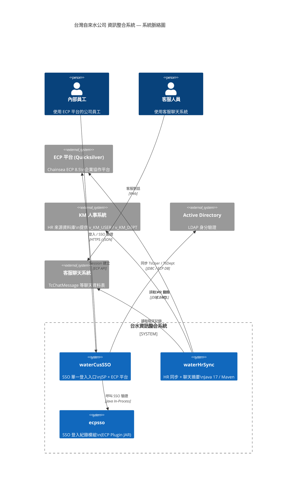
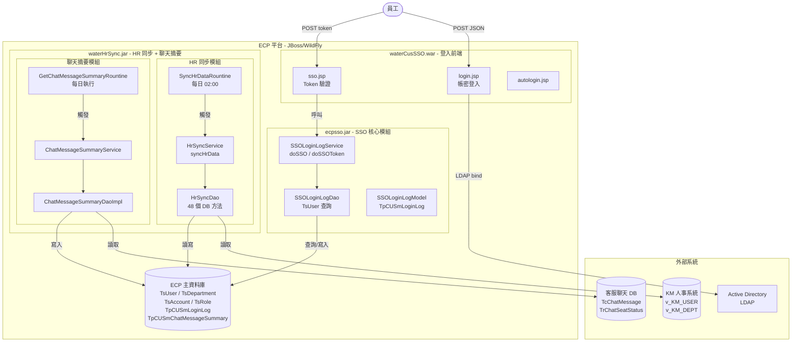
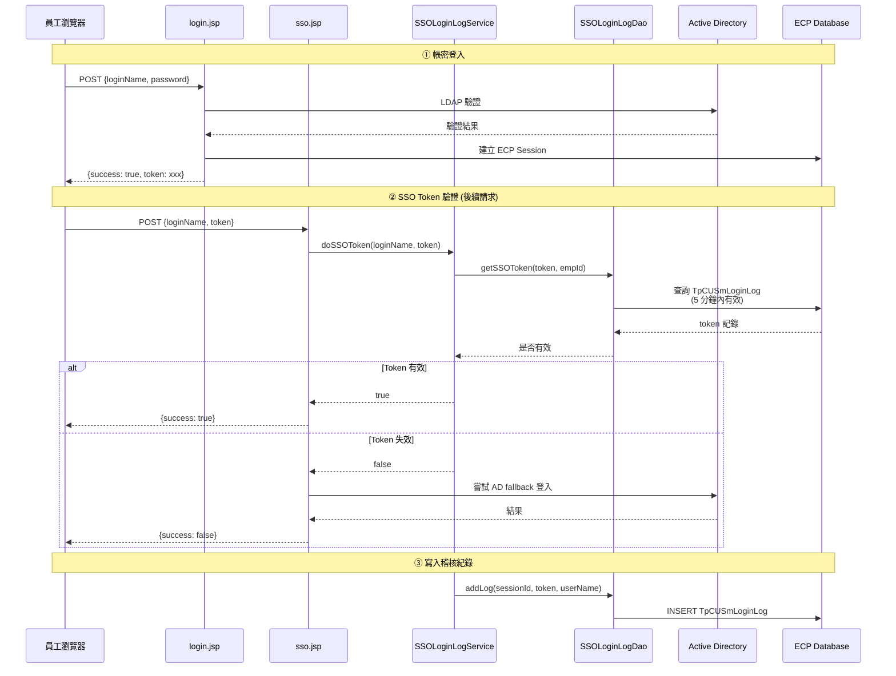
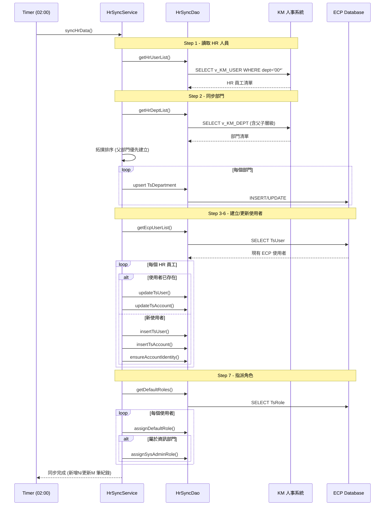
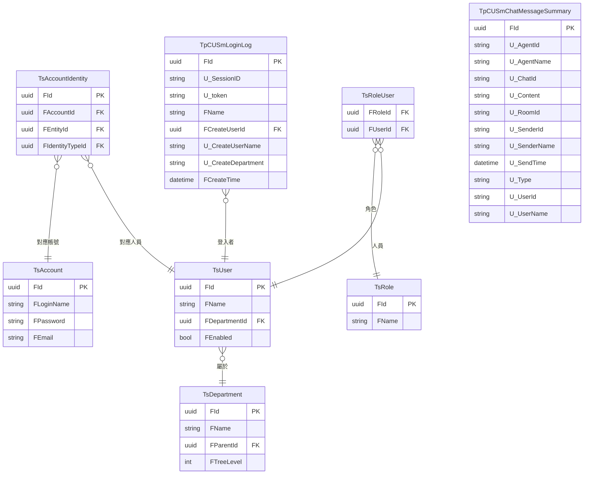
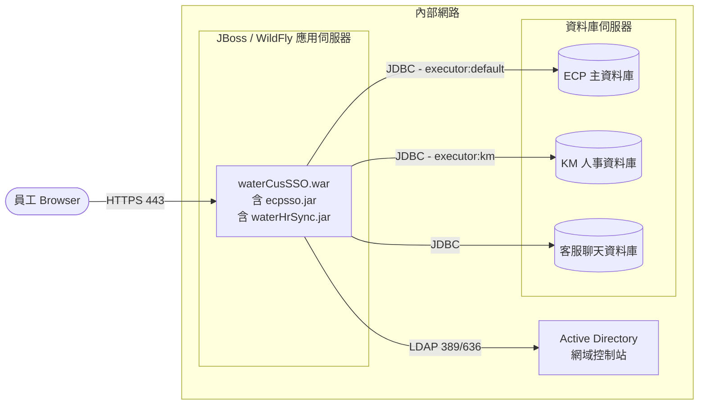

# 台灣自來水公司 資訊整合系統 — 架構圖

> 使用 [Mermaid](https://mermaid.js.org/) 語法，可直接貼入 GitHub / GitLab / Obsidian / draw.io 等工具渲染。

---

## 1. 系統整體架構 (System Context Diagram)

---

## 2. 容器架構圖 (Container Diagram)

---

## 3. SSO 登入流程 (Sequence Diagram)

---

## 4. HR 同步流程 (Sequence Diagram)

---

## 5. 資料庫 ER 圖

---

## 6. 部署架構圖

